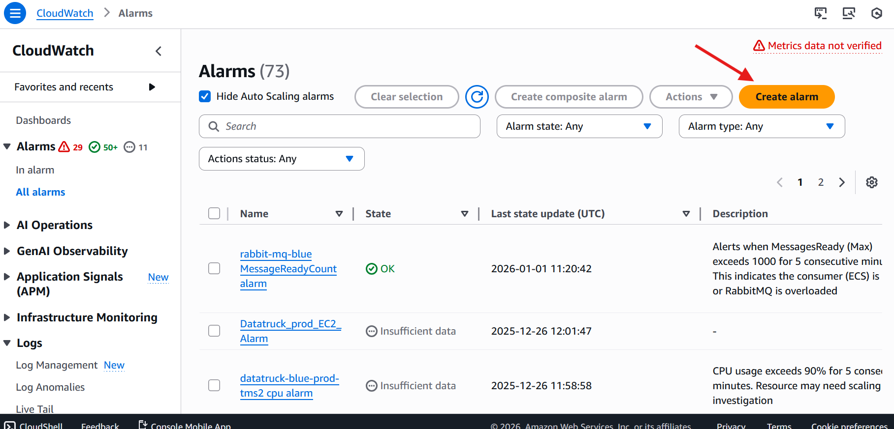
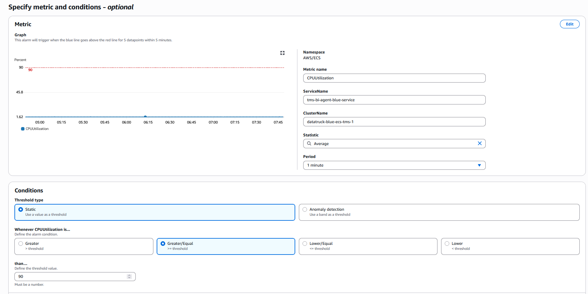

# AWS CloudWatch Alarm Setup Guide

This guide provides the configuration details and setup steps for the **ecs-bi-agent-blue cpu alarm**. This alarm monitors the CPU utilization of the specific ECS service and triggers notifications to Slack via SNS.

## 1. Metric Selection

1. Log in to the [AWS Management Console](console.aws.amazon.com).
2. In the left navigation pane, choose **Alarms** > **All alarms**.
3. Click **Create alarm**.
4. Click **Select metric**.
5. Select the **AWS/ECS** namespace.
6. Select **ClusterName, ServiceName** dimensions.
7. Search for and select the metric with the following details:
* **Metric Name:** `CPUUtilization`
* **ClusterName:** `datatruck-blue-ecs-tms-1`
* **ServiceName:** `tms-bi-agent-blue-service`





8. Click **Select metric**.

## 2. Metric and Conditions Configuration

* **Statistic:** Select `Average`.
* **Period:** Set to `1 minute` (60 seconds).
* **Threshold Type:** **Static**.
* **Condition:** `GreaterThanOrEqualToThreshold` (>=).
* **Threshold Value:** `90`.
* **Datapoints to alarm:** Set to `5 out of 5`.
* *Note:* This requires the threshold to be breached for 5 consecutive minutes.


* **Missing Data Treatment:** Select `notBreaching` (Missing data points are treated as "good" and will not trigger the alarm).


## 3. Notification and Action Configuration

* **Alarm state trigger:**
* **In alarm:** Select existing SNS topic `arn:aws:sns:us-east-2:629070900093:dt-aws-alert-to-slack`.
* **OK:** Select existing SNS topic `arn:aws:sns:us-east-2:629070900093:dt-aws-alert-to-slack`.


* **Auto Scaling Action:** (None configured for this specific alarm definition).

## 4. Name and Review

1. **Alarm name:** `ecs-bi-agent-blue cpu alarm`
2. **Alarm description:**
> Alerts when average cpu usage exceeds 90% for 5 consecutive minutes.
> This indicates the instance may need scaling or investigation.


3. **Review and create:** Confirm settings match the configuration above and click **Create alarm**.

## 5. Troubleshooting Alarm States

* **OK:** The average CPU utilization is below 90%.
* **ALARM:** The average CPU utilization has been >= 90% for 5 consecutive minutes.
* **INSUFFICIENT_DATA:** The ECS service may be stopped, or the alarm was just created.

---

### Programmatic Example (AWS CLI)

To recreate this specific alarm configuration via the terminal:

```bash
aws cloudwatch put-metric-alarm \
    --alarm-name "ecs-bi-agent-blue cpu alarm" \
    --alarm-description "Alerts when average cpu usage exceeds 90% for 5 consecutive minutes. This indicates the instance may need scaling or investigation." \
    --metric-name CPUUtilization \
    --namespace AWS/ECS \
    --statistic Average \
    --period 60 \
    --threshold 90 \
    --comparison-operator GreaterThanOrEqualToThreshold \
    --dimensions Name=ServiceName,Value=tms-bi-agent-blue-service Name=ClusterName,Value=datatruck-blue-ecs-tms-1 \
    --evaluation-periods 5 \
    --datapoints-to-alarm 5 \
    --treat-missing-data notBreaching \
    --actions-enabled \
    --ok-actions "arn:aws:sns:us-east-2:629070900093:dt-aws-alert-to-slack" \
    --alarm-actions "arn:aws:sns:us-east-2:629070900093:dt-aws-alert-to-slack"

```