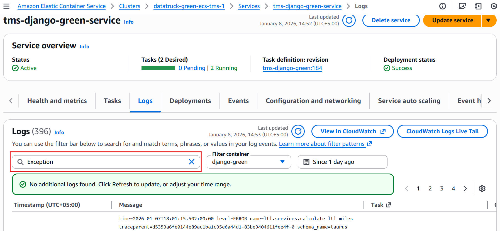
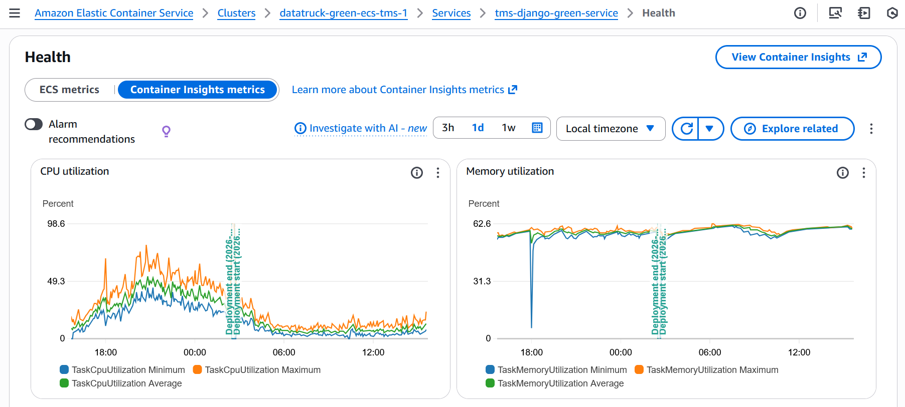

# AWS ECS Troubleshooting Guide

This guide provides a step-by-step walkthrough for investigating issues with the **tms-django-blue-service** on AWS ECS. It covers viewing application logs, checking service health, and analyzing performance metrics via Container Insights.

**Pre-requisites:**

* **Cluster Name:** `datatruck-blue-ecs-tms-1` 
* **Service Name:** `tms-django-blue-service`

---

## 1. Viewing Task Logs (CloudWatch)

Application logs are the primary source for debugging 500 errors, application crashes, or startup failures.

1. Log in to the [AWS Management Console](console.aws.amazon.com).
2. Navigate to **Elastic Container Service (ECS)**.
3. Select the cluster **datatruck-blue-ecs-tms-1**.
4. Click on the service **tms-django-blue-service**.
5. Click the **Logs** tab.
6. **Filter/Search:**
* Use the search bar to filter for keywords like `ERROR`, `Exception`, or `Traceback`.
* Select a specific log stream to view logs for a single task/container instance.



7. **Direct CloudWatch Access (Alternative):**
* Go to **CloudWatch** > **Log groups**.
* Search for the log group (commonly named `/ecs/tms-django-green-task-definition` or similar).
* Click **Search all** to query across all streams at once.


## 2. Checking Service Health & Events

If the service isn't starting or is constantly restarting, check the deployment events.

1. Navigate to **ECS** > **Cluster: datatruck-blue-ecs-tms-1** > **Service: tms-django-blue-service**.
2. Click the **Events** tab.
* **Look for:** "service ... has reached a steady state" (Good).
* **Look for:** "task ... failed container health checks" (Application health check failure).
* **Look for:** "task ... stopped (reason: Essential container in task exited)" (Crash loop).

* For more service event messages check [official documentation](https://docs.aws.amazon.com/search/doc-search.html?searchPath=documentation&searchQuery=event-messages&previousQuery=service-event-messages)


3. Click the **Tasks** tab.
* **Desired status:** `RUNNING`.
* **Last status:** If it says `STOPPED`, click the **Task ID** to see the **Stopped reason** (e.g., `Exit Code 1` for app error, `Exit Code 137` for Out of Memory).


## 3. Viewing Container Insights (Performance Metrics)

Use Container Insights to correlate crashes with resource spikes (CPU/Memory).

1. Navigate to **Health and metrics** tab > **Container Insights**.
2. In the dropdown menus at the top:
* **Performance monitoring:** Select `ECS Services`.
* **Cluster:** Select `datatruck-blue-ecs-tms-1`.
* **Service:** Select `tms-django-blue-service`.


3. Analyze the graphs:
* **CPU Utilization:** Is it consistently hitting 100% before a crash?
* **Memory Utilization:** Is it increasing (memory leak) until it hits the limit?
* **Network RX/TX:** specific spikes in traffic?




## 4. Common Troubleshooting Scenarios

* **Scenario: Crash Loop (Exit Code 1)**
* **Check:** Go to **Logs**. Look for syntax errors, missing environment variables, or database connection failures.


* **Scenario: Out of Memory (Exit Code 137)**
* **Check:** Go to **Container Insights**. Look at "Memory Utilization" maxing out.
* **Action:** Increase the `memory` hard limit in the Task Definition.


* **Scenario: Health Check Failing**
* **Check:** Go to **Events** tab.
* **Action:** Verify the application is listening on the correct port and the health check path (e.g., `/health/`) returns a 200 OK status code.


---

### Programmatic Example (AWS CLI)

To quickly fetch the last 20 log events for a specific task in this service:

```bash
# 1. List tasks to get a Task ID
aws ecs list-tasks \
    --cluster datatruck-blue-ecs-tms-1 \
    --service-name tms-django-blue-service

# 2. Get logs (Replace TASK_ID and CONTAINER_NAME)
aws logs get-log-events \
    --log-group-name /ecs/tms-django-green-task-def \
    --log-stream-name ecs/django-green-container/TASK_ID_HERE \
    --limit 20

```