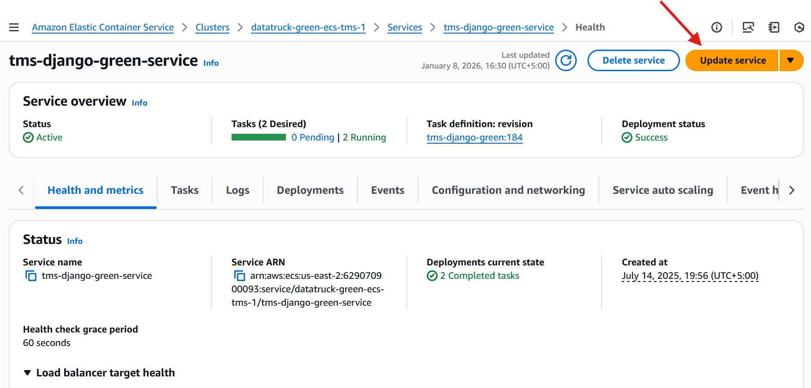
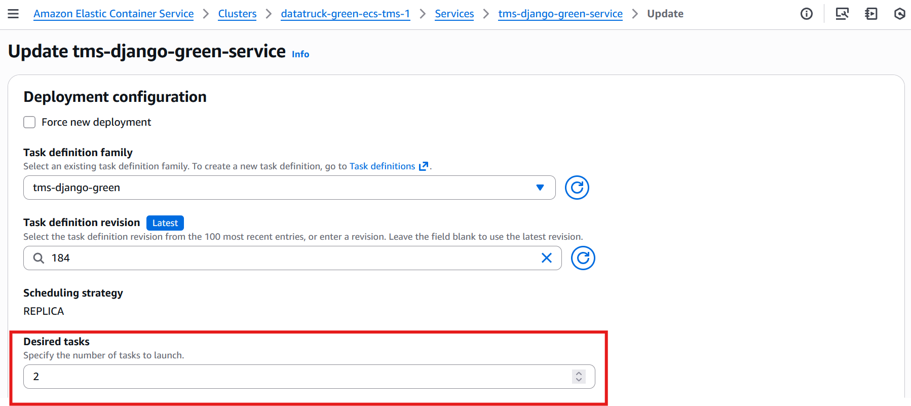
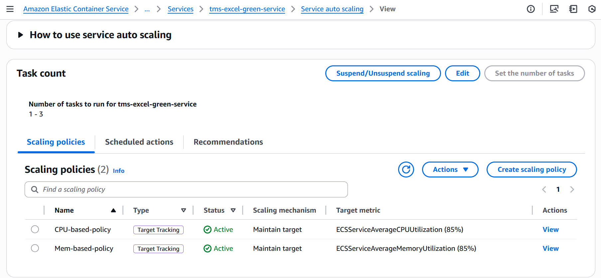

# ECS Service Scaling Runbook

**Service:** `tms-django-green-service`  
**Cluster:** `datatruck-green-ecs-tms-1`

---

## Option 1: Manual Scaling (Service Update)

Use this method for ad-hoc changes (e.g., preparing for a known marketing event or manually recovering from a load spike).

### A. Via AWS Console

1. Navigate to the **Amazon ECS** console.
2. Select Cluster **datatruck-green-ecs-tms-1**.
3. Select Service **tms-django-green-service**.
4. Click **Update service**.



5. In the **Desired tasks** field, enter the new number of tasks/containers you want running (e.g., change `2` to `4`).
6. *Optional:* Expand "Force new deployment" if you want to recycle existing tasks (usually not needed just for scaling).
7. Click **Update**.
8. **Verify:** Click the **Tasks** tab and watch for new tasks entering the `PROVISIONING` -> `PENDING` -> `RUNNING` state.



### B. Via AWS CLI

```bash
aws ecs update-service \
    --cluster datatruck-green-ecs-tms-1 \
    --service tms-django-green-service \
    --desired-count 4

```

---

## Option 2: Automated Service Auto Scaling (Recommended)

Use this method to let AWS automatically add/remove tasks based on CPU or Memory usage. This prevents you from paying for idle resources at night or crashing during the day.

### 1. Target Tracking Policy (CPU Example)

This policy tells AWS: *"Keep average CPU at 70%. If it goes higher, add tasks. If it drops lower, remove tasks."*

1. Go to **ECS** > **Cluster** > **Service** > **Service auto scaling** tab.
2. Click **Edit**.
3. **Minimum tasks:** Set the floor (e.g., `2`).
4. **Maximum tasks:** Set the ceiling (e.g., `10`).
5. **Scaling Policy Type:** Select **Target tracking**.
6. **Policy Name:** `cpu-target-tracking-70`
7. **ECS service metric:** `ECSServiceAverageCPUUtilization`.
8. **Target value:** `70`.
9. **Scale-out cooldown:** `60` seconds (how long to wait before adding *more* tasks after a scale event).
10. **Scale-in cooldown:** `300` seconds (wait longer to remove tasks to ensure load is truly gone).



### 2. Programmatic Setup (AWS CLI)

This requires two steps: registering the target, then applying the policy.

```bash
# 1. Register the service as a scalable target (Min: 2, Max: 10)
aws application-autoscaling register-scalable-target \
    --service-namespace ecs \
    --scalable-dimension ecs:service:DesiredCount \
    --resource-id service/datatruck-blue-ecs-tms-1/tms-django-green-service \
    --min-capacity 2 \
    --max-capacity 10

# 2. Apply CPU Target Tracking Policy
aws application-autoscaling put-scaling-policy \
    --service-namespace ecs \
    --scalable-dimension ecs:service:DesiredCount \
    --resource-id service/datatruck-blue-ecs-tms-1/tms-django-green-service \
    --policy-name cpu-target-tracking \
    --policy-type TargetTrackingScaling \
    --target-tracking-scaling-policy-configuration '{
        "TargetValue": 70.0,
        "PredefinedMetricSpecification": {
            "PredefinedMetricType": "ECSServiceAverageCPUUtilization"
        },
        "ScaleOutCooldown": 60,
        "ScaleInCooldown": 300
    }'

```

---

## Option 3: Scheduled Scaling

Use this if you have predictable traffic patterns (e.g., traffic spikes every morning at 9 AM).

1. Go to **ECS** > **Cluster** > **Service** > **Service auto scaling** tab.
2. Under **Scheduled actions**, click **Create**.
3. **Name:** `scale-up-morning`.
4. **Cron expression:** `0 18 ? * MON-FRI *` (Monday to Friday at 18:00).
5. **Min/Max/Desired:** Update Desired to `5` (Min `5`, Max `10`).
6. *Important:* Create a counterpart "scale-down" action for the evening (e.g., 6 PM) to lower the counts back to `2`.

---

## ⚠️ Critical Note on Infrastructure Capacity

Increasing the **Task Count** (Service Scaling) only works if your underlying **Cluster Infrastructure** (EC2 instances) has enough CPU/RAM to host the new containers.

* **If using Fargate:** You generally don't need to worry about this; AWS allocates compute on demand.